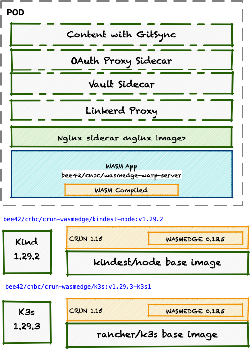

# Utilize a polyglot container runtime for your pods

We want combine CRUN with WASM plugins to use process container side by side with wasm modules.

## Once upon a time


Once upon a time in the realm of cloud computing, there was a skilled web developer named Gina, renowned for her expertise in containerization and Kubernetes. Gina had been intrigued by the emerging technology of WebAssembly (Wasm) and its potential applications within containerized environments. Eager to explore this further, Gina embarked on a quest to create a specialized Kubernetes image.

The goal was ambitious yet clear: to craft a K3s image embedded with support for both CRUN, a lightweight container runtime, and Wasmedge, a versatile WASM runtime. To begin her journey, Gina first gathered the necessary tools and materials. She installed the Docker engine on her trusty development machine, ensuring a stable foundation for container creation. It sounds like Gina was inspired by the notion of utilizing the WebAssembly (WASM) API both in browser environments and within backend systems like Kubernetes. However, DevOps Joe cautioned her that this approach might not align well with the security requirements of backend systems. Injecting a Service Mesh or Secrets isn't supported in WASM container runtimes. There are crucial reasons to abandon this idea. However, what's preventing Gina from developing a CRUN executable incorporating Wasmedge as a module?

Next, Gina delved into the world of Kubernetes orchestration tools, acquiring both Kind and k3d to aid in the development and testing process. Armed with these powerful tools, Gina felt ready to tackle the challenge ahead.

With determination in her heart and code in her fingers, Gina set out to assemble the pieces of her creation. She meticulously crafted a Dockerfile, skillfully integrating CRUN and Wasmedge into the K3s image. Hours turned into days as Gina fine-tuned the configuration, ensuring seamless compatibility and optimal performance.

Finally, after much toil and dedication, the moment of truth arrived. Gina built the custom K3s image with bated breath, watching as the lines of code transformed into a tangible artifact of her labor. With a sense of accomplishment and anticipation, Gina deployed the image onto a Kubernetes cluster spun up with Kind and k3d.

As the containers sprung to life within the cluster, Gina's excitement grew. Her creation, a fusion of cutting-edge technologies, was now a reality. With CRUN and Wasmedge working in harmony, the K3s image promised new possibilities for leveraging the power of WebAssembly in Kubernetes environments.

And so, Gina's journey stands as a powerful affirmation of the spirit of innovation and exploration in the dynamic realm of cloud computing. With each challenge embraced and conquered, new horizons of possibility emerge, waiting to be discovered by those brave enough to seek them out.

__A glimpse into the future of ChatGPT based tech writing: Envisioning the next chapter of what is todo. Nice!__

## Describe the polygot Container Runtime challenge more technically

The topic of AI workload and enhancing the robustness of web applications through WebAssembly (WASM) modules is gaining significant traction. At the recent KubeCon, KubeSpin made headlines by unveiling their initiative to integrate WASM into Kubernetes clusters.

My preferred Kubernetes distribution, k3s, now seamlessly supports all WASM runtimes by default. The installation of WebAssembly runtimes has become effortlessly achievable with the [KWasm|(https://github.com/KWasm/kwasm-operator) operator, sparking enthusiasm and fostering a wave of innovation.

However, a limitation arises within Pods: only a single runtime can be selected for the containers within. This means that mixing WASM modules with traditional images isn't feasible. This restriction curtails the use of sidecars, initContainers, or injection of secrets and service meshes for WASM applications, posing a significant challenge for developers.

__Stopp__: It's highly unlikely that the issue is valid!

A few days later: After encountering numerous posts, rumors, hints, and ideas, I've decided to embrace the challenge of constructing a CRUN WASM runtime.

## Kickstart a Container Runtime __HACK__...

Formulate a developer challenge:

* Acknowledge that a WASM runtime is essentially just a normal Linux binary.
  * Is it possible to utilize the functionality of the WASM Runtime as a library?
  * Are there any Container Runtimes available that support switching the runtime module?
* Explore older indications suggesting that CRUN can switch the runtime executable through annotations.
* Search for a straightforward example of a WASM application, such as an echoserver.
* Experiment with building container images for combined conainer runtime based on K3d/K3s and Kind.
* Ensure the use of the latest versions of all components involved.
* Execute the setup and give it an opportunity to run successfully.

Start preparation:

* Install a Docker engine at my mac.
* Install Kind and k3d tools.
* Install kubectl, helm, [krew](https://krew.sigs.k8s.io)
* Assemble all the necessary components together.

```shell
brew install --cask docker
brew install k3d kind helm kustomize jq kubernetes-cli krew
kubectl krew install ns,ctx,images,node-shell
```

Create a blueprint of the vision



## Kickstart with CRUN-WASM at Kind

Read this to better learn why it works:

* https://github.com/containers/crun/blob/main/docs/wasm-wasi-on-kubernetes.md
  * CRUN support of WASM Container Runtime Annotations
* https://github.com/Liquid-Reply/kind-crun-wasm
  * Example kind with wasm
* https://github.com/WasmEdge/WasmEdge/releases
* https://wasmedge.org/docs/develop/deploy/kubernetes/kind/
  * Kind support
* https://github.com/containers/crun/blob/main/README.md  
  * crun compile
* https://github.com/hectorballega/k3s-cuda/blob/main/config.toml.tmpl
  * cuda config.toml.tmpl
* https://kind.sigs.k8s.io/docs/user/quick-start/#installing-from-release-binaries
  * Quickstart

```shell
# build the image - review [Dockerfile](kind//wasmedge/Dockerfile)
docker build -t bee42/crun-wasm/kindest-node:wasmedge-v1.29.2 ./kind/wasmedge
# create kind cluster
cat <<EOF | kind create cluster --image=bee42/crun-wasm/kindest-node:wasmedge-v1.29.2 --name crun-wasm --config=-
kind: Cluster
apiVersion: kind.x-k8s.io/v1alpha4
containerdConfigPatches:
- |-
  [plugins."io.containerd.grpc.v1.cri".containerd.runtimes."crun"]
    runtime_type = "io.containerd.runc.v2"
    pod_annotations = ["*.wasm.*", "wasm.*", "module.wasm.image/*", "*.module.wasm.image", "module.wasm.image/variant.*"]
  [plugins."io.containerd.grpc.v1.cri".containerd.runtimes."crun".options]
    BinaryName = "/usr/local/sbin/crun"
    SystemdCgroup = false
EOF
# Configure [runtimes](kind/runtime.yaml) 
k apply -f kind/wasmedge/runtime.yaml

# Try out a wasm hack...
# Only work at amd64??
kubectl run -it --rm --restart=Never wasi-demo \
  --image=wasmedge/example-wasi:latest \
  --annotations="module.wasm.image/variant=compat-smart" \
  /wasi_example_main.wasm 50000000

# Build the [httpServer](warp-server/Dockerfile)
# work at amd64 and arm64
docker build -t bee42/crun-wasm/warp-server ./warp-server
# Import the wasmedge-warp-server to Kind
docker image save bee42/crun-wasm/warp-server:latest -o kind/wasmedge-warp-server.tar 
docker cp kind/wasmedge-warp-server.tar crun-wasm-control-plane:/opt/wasmedge-warp-server.tar
docker exec crun-wasm-control-plane ctr -n k8s.io image import  /opt/wasmedge-warp-server.tar
```

Create a image with spezical older releases of Kind 1.29.1, and ...

```shell
docker build \
  --build-arg KIND_VERSION=1.29.1 \
  --build-arg CRUN_VERSION=1.12 \
  --build-arg WASMEDGE_VERSION=0.14.0-rc.4 \
  -t bee42/crun-wasm/kindest-node:v1.29.1-crun-1.12-wasmedge-0.14.0-rc.4 ./kind/wasmedge
```

```shell
docker build \
  --build-arg KIND_VERSION=1.29.2 \
  --build-arg CRUN_VERSION=1.12 \
  --build-arg WASMEDGE_VERSION=0.13.5 \
  -t bee42/crun-wasm/kindest-node:v1.29.2-crun-1.12-wasmedge-0.13.5 ./kind/wasmedge
```

## Exciting news! Mixed runtime loading inside a pod is now a reality

Begin your WASM development journey with the combined CRUN/Wasmedge runtime. Now, leverage standard init and sidecar containers for:

* Service mesh proxies
* Secret injectors
* Content synchronization with gitsync
* Metric, log, or trace exporters
* Log formatters
* InitContainers
* Protocol adapters

Happy coding: Hope my example works for you!

```shell
#kubectl ctx k3d-wasm
kubectl create namespace demo
kubectl ctx kind-crun-wasm
kubectl ns demo
cat <<EOF | kubectl apply -n demo -f -
apiVersion: apps/v1
kind: Deployment
metadata:
  name: wasmedge-warp-server
  labels:
    app: wasmedge-warp-server
spec:
  selector:
    matchLabels:
      app: wasmedge-warp-server
  template:
    metadata:
      labels:
        app: wasmedge-warp-server
      annotations:
        module.wasm.image/variant: compat-smart
    spec:
      containers:
      - image: nginx
        name: nginx
      - name: wasm
        image: bee42/crun-wasm/warp-server
        imagePullPolicy: Never
        ports:
        - containerPort: 8080
          protocol: TCP
        livenessProbe:
          tcpSocket:
            port: 8008
          initialDelaySeconds: 3
          periodSeconds: 30
      runtimeClassName: crun
EOF
k get pods -w
NAME                                    READY   STATUS              RESTARTS   AGE
wasmedge-warp-server-54b8c587b5-86zjp   0/2     ContainerCreating   0          10s
wasmedge-warp-server-54b8c587b5-86zjp   2/2     Running             0          51s

# Yeah working...

kubectl port-forward deployment/wasmedge-warp-server 8081:80 8082:8080 &
curl localhost:8081
curl localhost:8082/echo -XPOST -d 'Let us say: WASM with CRUN create happiness!'
```

### Wasmer support (untested)

```shell
# build the image - review [Dockerfile](kind//wasmer/Dockerfile)
docker build -t bee42/crun-wasm/kindest-node:wasmer-v1.29.2 ./kind/wasmer
```

* Add sample application different languages (rust,c)
* Understand different engines
* Setup different crun runtimes same node?
  * change runtime names?

Example config (untested)

```yaml
kind: Cluster
apiVersion: kind.x-k8s.io/v1alpha4
containerdConfigPatches:
- |-
  [plugins."io.containerd.grpc.v1.cri".containerd.runtimes."crun-wasmer"]
    runtime_type = "io.containerd.runc.v2"
    pod_annotations = ["*.wasm.*", "wasm.*", "module.wasm.image/*", "*.module.wasm.image", "module.wasm.image/variant.*"]
  [plugins."io.containerd.grpc.v1.cri".containerd.runtimes."crun-wasmer".options]
    BinaryName = "/usr/local/sbin/crun-wasmer"
    SystemdCgroup = false
  [plugins."io.containerd.grpc.v1.cri".containerd.runtimes."crun-wasmedge"]
    runtime_type = "io.containerd.runc.v2"
    pod_annotations = ["*.wasm.*", "wasm.*", "module.wasm.image/*", "*.module.wasm.image", "module.wasm.image/variant.*"]
  [plugins."io.containerd.grpc.v1.cri".containerd.runtimes."crun-wasmedge".options]
    BinaryName = "/usr/local/sbin/crun-wasmedge"
    SystemdCgroup = false
```

```yaml
apiVersion: node.k8s.io/v1
kind: RuntimeClass
metadata:
  name: crun-wasmedge
handler: crun-wasmedge
---
apiVersion: node.k8s.io/v1
kind: RuntimeClass
metadata:
  name: crun-wasmer
handler: crun-wasmer
```

## Kickstart with CRUN-WASM at K3s (doesn't work)

* https://github.com/KWasm/kwasm-operator
* https://github.com/WasmEdge/WasmEdge/releases
* https://wasmedge.org/docs/develop/deploy/kubernetes/kind/
  * Kind support
* https://github.com/containers/crun/blob/main/README.md  
  * crun compile
* https://github.com/hectorballega/k3s-cuda/blob/main/config.toml.tmpl
  * cuda config.toml.tmpl

```shell
# build the image - review [Dockerfile](k3s/Dockerfile)
# this need time!
docker build -t bee42/crun-wasm/k3s:v1.29.3-k3s1 ./k3s
# Create a small demo wasm cluster with k3d
k3d cluster create wasm --image=bee42/crun-wasm/k3s:v1.29.3-k3s1
# Build the [httpServer](http-server/Dockerfile)
# Review [echoserver](http-server/src/main.rs)
docker build -t bee42/crun-wasm/warp-server ./http-server
# Import the demo image
k3d image import -c wasm bee42/crun-wasm/warp-server
# Review runtime container.d configuration [config.toml.tmpl](k3s/config.toml.tmpl)
docker exec k3d-wasm-server-0 /bin/sh -c "cat >/var/lib/rancher/k3s/agent/etc/containerd/config.toml"
kubectl get runtimeclasses.node.k8s.io 
NAME                  HANDLER               AGE
crun                  crun                  4m43s
lunatic               lunatic               4m43s
nvidia                nvidia                4m43s
nvidia-experimental   nvidia-experimental   4m43s
slight                slight                4m43s
spin                  spin                  4m43s
wasmedge              wasmedge              4m43s
wasmer                wasmer                4m43s
wasmtime              wasmtime              4m43s
wws                   wws                   4m43s
```

Why Rancher container.d use a older pause image?

```text
{{ template "base" . }}
# File generated by k3s. DO NOT EDIT. Use config.toml.tmpl instead.
  sandbox_image = "rancher/mirrored-pause:3.6"
```

Failure k3d-wasm

```text
  Warning  Failed     5s (x3 over 19s)  kubelet            Error: failed to create containerd task: failed to create shim task: OCI runtime create failed: executable file `wasmedge_warp_server.wasm` not found in $PATH: No such file or directory: unknown
  Warning  BackOff    5s (x3 over 18s)  kubelet            Back-off restarting failed container wasm in pod wasmedge-warp-server-54b8c587b5-h2djl_demo(d813f24d-5e4d-4771-ac01-998bf7165b9f)
```

Fix this to copy all LDD deps :) ARGGSS....

```text
  Warning  Failed     2s (x3 over 17s)  kubelet            Error: failed to create containerd task: failed to create shim task: OCI runtime create failed: could not load `libwasmedge.so.0`: `Error relocating /usr/local/lib/libwasmedge.so.0: mallinfo: symbol not found`: unknown
  Warning  BackOff    2s (x2 over 15s)  kubelet            Back-off restarting failed container wasm in pod wasmedge-warp-server-59fd75f8b7-p5t65_demo(33c0c4e5-86ba-488b-93dd-4e0b184d114e)
```

## Teardown the walls

```shell
kind delete cluster --name crun-wasm
k3d delete cluster wasm
```

## Todo

* Fix K3d/K3s integration (Prio)
* Test real installations (k3s and kubeadm-based).
* Utilize RUNC and CRUN as runtime options.
* Setup GitHub Action to publish the images (amd64/arm64).
* Dockerfile: Enhance the copying of ldd libwasmedge.
  * Multiarch builds.
  * Update:
    * WasmEdge to version 0.14.0-rc.4. (Check WasmEdge releases)
    * Explore WasmEdge Plugins.
* Create a enhance example:
  * Set up a WASM HTTP Server with a gitsync example.
  * Implement Linkerd proxy injection.
* Include relevant pictures.
* Create a working example with CRI-O.
* Add Kubespin example
* Add examples wasmer, spin, wasmtime

Now Gina and Joe starts there day together with a smile :-)
This isn't the end of the story; rather, it's a truly promising starting point.

__You build IT, you run IT!__

Regards,
[`|-o-|` Your minion tour guide - Peter](mailto://peter.rossbach@bee42.com)

This project is power by bee42


